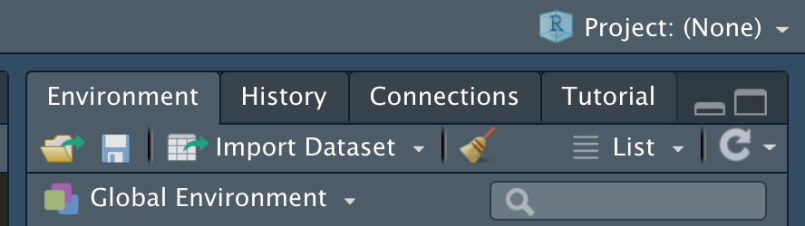

# Learning Objectives<br>

* Understand difference between relative and absolute file paths.
* Understand why projects are important for reproducible work in R.
* Understand relative file paths in R projects. 
* Understand the use of `here()` in .Rmd files in projects. 

**Duration - 30 minutes**


This is a short lesson to consolidate our understanding of relative paths and R Projects. Understanding this is important and fundamental to reproducible work in R so ask questions along the way if you are unsure! 

First let's start with some definitions: 

* The specification of the list of folders to travel and the file name is called a **path** e.g. *"C:/Documents/data/dataset1.csv"* for Windows or *"/Users/user/data/dataset1.csv"* for Mac.  

* A path that starts at the root folder of the computer is called an **absolute path**.   

* A **relative path** starts at a given folder and provides the folders and file starting from that folder.    

We strongly encourage the use of projects in R  (`.Rproj`). One of the big reasons for this is it allows the use of relative file paths, which means other people can run your code. If you don't have relative file paths (and use absolute paths), these are specific to your computer and so won't run on someone else's computer, unless they have the exact same file structure etc. - which is highly unlikely! 

You should never have something like

```{r, eval = FALSE}
read_csv("~/codeclan_work/week_01/day_1/lesson_1/data.csv")
```

or

```{r, eval = FALSE}
read_csv("/Users/user/codeclan_work/week_01/day_1/lesson_1/data.csv")
```

These are specific to your computer as another person may not have this data saved in a folder called 'data' within a folder called 'lesson_1' and so on... 

Let's take a look at an example to demonstrate relative file paths in projects. 

# Example 

In this lesson folder you should have 2 folders `no_project_example` and `project_example`. 

Let's start with `no_project_example`. We're going to open the `reading_in_data_script.R` and complete the code in this file. Make sure you aren't within another project when you open this file. You can check this on the top right hand corner of your R Studio, it should say 'Project (None)' - if it doesn't use the drop-down to close the project you have open:



We will work through the code in this example together. 

We will then **open the project file** to open the project in `project_example` and complete the code in the .R file and then the .Rmd file. 

# Setting up projects 

What happens if you already have a bunch of scripts and data files saved in a folder but it isn't a project but you want it to be. Remember you can make a folder and R project after you’ve already set up the folders on your computer. 

In R Studio go to *‘File’ -> ‘New project’ -> ‘Existing directory’ -> Navigate to the folder you want to make a project* (i.e. the root folder of your project). 

The alternative to this is setting up a project from scratch and creating or moving files in after creation. 

# Extra resources 

If you want to read up more on this or see some more examples here's some resources:

* More about R Projects [here](https://r4ds.had.co.nz/workflow-projects.html) 
* More about `here()` function [here](https://github.com/r-lib/here)
* Blog on workflow, projects and `here()` [here](https://malco.io/2018/11/05/why-should-i-use-the-here-package-when-i-m-already-using-projects/)